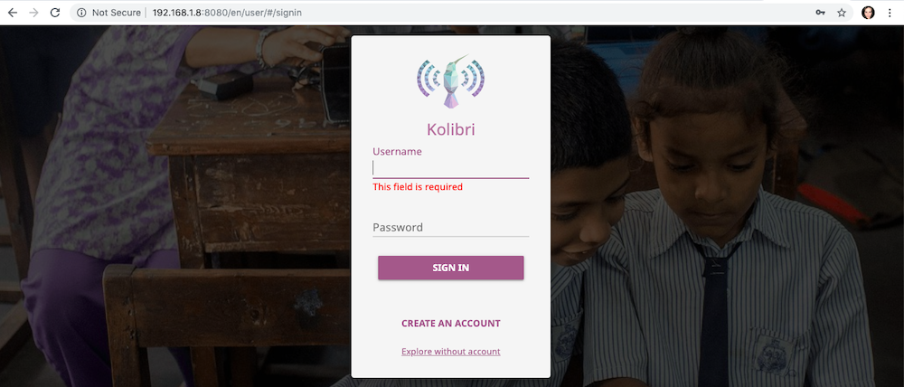

# Run Planet and Kolibri

15, November 2019 • [irisb1701](https://github.com/irisb1701)

---

Kolibri is a platform used by our "competitor" organization called Learning Equality similar to what Planet is for Open Learning Exchange.

Below are instructions on how to run Kolibri on treehouses:

1. Plug your RPi in and ssh into treehouses
1. If you don't already have docker installed, follow [these instructions](https://docs.docker.com/v17.09/engine/installation/) on their official page to install it on mac/windows
1. Now, go to the [treehouses github](https://github.com/treehouses)
1. Scroll down until you find the `kolibri` repository
1. Once in the repo, scroll down to where the readme.md file is displayed
1. Copy the link provided: `docker run -v /data/save/location:/root/.kolibri -p 8080:8080 treehouses/kolibri`
1. Replace `/data/save/location` with `/srv/kolibri`
1. Run the above command in your terminal
1. Give it some time to process
1. Enter your RPi IP address in browser followed by :8080, Example: `192.168.1.8:8080`
1. You should now see the Kolibri interface
   
1. You can create an account and browse around, you will see it is not very different from planet learning.
1. You can import learning materials the same way you would in the planet
   
1. You can pull up planet on your browser as well by entering just the ip address of your RPi in another browser
   
1. Now you have successfully ran kolibri on treehouses and can compare and contrast it with planet

---

If you want to make sure you are using the latest version of kolibri you can check like this:

1. Go to hub.docker.com
1. Search for treehouses/kolibri (2nd result)
1. Select it, then select tags
1. 
1. View the last updated version and cross check by googling kolibri's current version

##Preinstall Kolibri
You can also have Kolibri pre-installed before even booting the image. If you are interested in seeing how .yml files are connected to docker containers, do the following steps instead of the above:

1. Flash a new treehouses image
1. Before booting the image, go to the boot file and open the `autorunonce` file
    - As you may know, the `autorunonce` file will execute one time, when you first ssh into treehouses, and then become `autoranonce`. When you access the image, everything executed in the `autorunonce` file will still be configured
1. Set up your internet login settings first
1. Scroll down to line 159 and create a new line below with the following command:
    - `echo "docker-compose -f /boot/kolibri.yml -p kolibri up -d"`
1. This line will create  a docker container for kolibri using a kolibri.yml file
1. To create our .yml file we will open a new file in our IDE and include the following lines:
1. ```services:
        kolibri:
        image: treehouses/kolibri
        ports:
          - "8080:8080"
        volumes:
          - "/srv/kolibri:/root/.kolibri"
      version: "2"````
1. In this file it is important that we define the port `8080` that we can view kolibri on and the volume, or where kolibri will be retreived from `/srv/kolibri:/root/.kolibri)`
1. Save this file with a .yml extension and place it inside your boot file
1. Now when you run your new image and ssh into treehouses, a kolibri container will automatically be created.
1. If you run the command `docker ps` you will see the current running docker containers and the ports they can be viewed on
1. You will see our 2 containers, planet and couchdb on ports 80 and 2200 respectively
1. If you enter your RPi's IP address followed by a colon and these ports on a browser you can view the containers, ie. `192.168.1.8:2200`
1. Unlike these 2 containers which are already preinstalled and can be viewed automatically, Kolibri will only appear once you have rebooted treehouses
1. Perform a reboot and run `docker ps` once again, you will now see the kolibri container without having to wait for it to download.
1. View Kolibri on port 8080 on your browser
