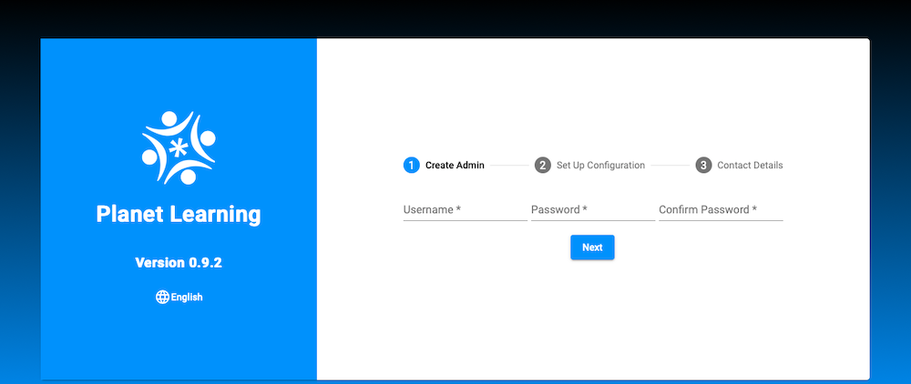

# Run Planet and Kolibri

18, November 2019 • [irisb1701](https://github.com/irisb1701)

---

Kolibri is a platform used by our "competitor" organization called Learning Equality similar to what Planet is for Open Learning Exchange.

Below are instructions on how to run Kolibri on treehouses:

## Run Kolibri using Autorunonce
The steps described below will show you how to modify the `autorunonce` file to create a docker container so that kolibri is presintalled and ready to go as soon as you boot your new image. This method is the exact same way we use docker and .yml files to view planet.

1. Flash a new treehouses image
1. Before booting the image, go to the boot file and open the `autorunonce` file
    - As you may know, the `autorunonce` file will execute one time (when you first ssh into treehouses) and then will become `autoRANonce`. That way, every time you access the image, everything executed in the `autorunonce` the first time will remain configured and will not be re-executed
1. Make the following changes to the `autorunonce` file
    - This is optional, however you can Cmd/ctrl + F for the phrase 'start planet' and replace it with 'start services' since we are running both planet and kolibri now instead of just planet
    - Set up your internet login settings
    - ``` 
          wifiname='YourWifiName'
          wifipassword='YourWifiPassword'
      ```
    - Include port 8080 in tor which we will use for Kolibri
    - ``` 
        if [ $starttor = "true" ]; then
          treehouses tor add 22
          if [ $startservices = "true" ]; then
            treehouses tor add 80
            treehouses tor add 2200
            treehouses tor add 8080 <--- add here
          fi   
      ```
    - Scroll to where the autorun file is being created and add the following command
    - ```
       {
         echo "#!/bin/sh"
         echo
         echo "if [ \"$(treehouses container)\" = \"balena\" ]; then"
         echo "  export DOCKER_HOST=localhost:2375"
         echo "fi"
         echo "sleep 1"
         echo
         echo "if [ -f /srv/planet/pwd/credentials.yml ]; then"
         echo "  docker-compose -f /srv/planet/planet.yml -f /srv/planet/volumes.yml -f /srv/planet/pwd/credentials.yml -p planet up -d"
         echo "else"
         echo "  docker-compose -f /srv/planet/planet.yml -f /srv/planet/volumes.yml -p planet up -d"
         echo "fi"
         echo
         echo "docker-compose -f /srv/kolibri/kolibri.yml -p kolibri up -d" <--- add this line here
       } > /boot/autorun  
         ```
         - For context, the autorun file is being created by the `> /boot/autorun` command and placed in our boot folder. This is why after booting your image for the first time, you will see in your boot file `autorunonce` has turned into `autoranonce`, and directly below is a new file called `autorun`. This file, unlike autorunonce, executes every time treehouses is booted and can be modified and re-executed multiple times.
1. This new line `echo "docker-compose -f /boot/kolibri.yml -p kolibri up -d"` will create a docker container for kolibri using a kolibri.yml file
1. To create our .yml file we will open a new file in our IDE and include the following lines:
1. ```
services:
  kolibri:
    image: treehouses/kolibri
    ports:
      - "8080:8080"
    volumes:
      - "/srv/kolibri:/root/.kolibri"
version: "2"
```
1. In this file it is important that we define the port `8080` that we can view kolibri on and the volume, or where kolibri will be retreived from `/srv/kolibri:/root/.kolibri`
1. Save this file with a .yml extension and place it inside your boot file
1. Now when you run your new image and ssh into treehouses, a kolibri container will automatically be created.
1. If you run the command `docker ps` you will see the current running docker containers and the ports they can be viewed on
1. You will see our 2 containers, planet and couchdb on ports 80 and 2200 respectively
1. If you enter your RPi's IP address followed by a colon and these ports on a browser you can view the containers, ie. `192.168.1.8:2200`
1. Unlike these 2 containers which Dogi has already preinstalled and can be viewed automatically, Kolibri will only appear once you have rebooted treehouses
1. Perform a reboot and run `docker ps` once again, you will now see the kolibri container without having to wait for it to download.
1. View Kolibri on port 8080 on your browser


## Run Kolibri Manually
Another way to run Kolibri is to do it manually using docker commands which can be done using the following steps:

1. Plug your RPi in and ssh into treehouses
1. If you don't already have docker installed, follow [these instructions](https://docs.docker.com/v17.09/engine/installation/) on their official page to install it on mac/windows
1. Run the following command in your terminal:
    - `docker run -v /srv/kolibri:/root/.kolibri -p 8080:8080 treehouses/kolibri`
    - This command can be found on [treehouses github](https://github.com/treehouses) in the `kolibri` repository inside the README.md
    - The change we made is replacing `/data/save/location` with `/srv/kolibri`
1. Now a kolbri container is being created, which will take a few moments
1. Enter your RPi IP address in your browser followed by :8080, Example: `192.168.1.8:8080`
1. You should now see the Kolibri interface
   

## Congrats, you've successfully run Kolibri on Treehouses

1. You can create an account and browse around, you will see it is not very different from planet learning.
1. You can import learning materials the same way you would in the planet
   
1. You can pull up planet on your browser as well by entering just the ip address of your RPi in another browser
   
1. Now you have successfully ran kolibri on treehouses and can compare and contrast it with planet

---

If you want to make sure you are using the latest version of kolibri you can check like this:

1. Go to hub.docker.com
1. Search for treehouses/kolibri (2nd result)
1. Select it, then select tags
1. 
1. View the last updated version and cross check by googling kolibri's current version
